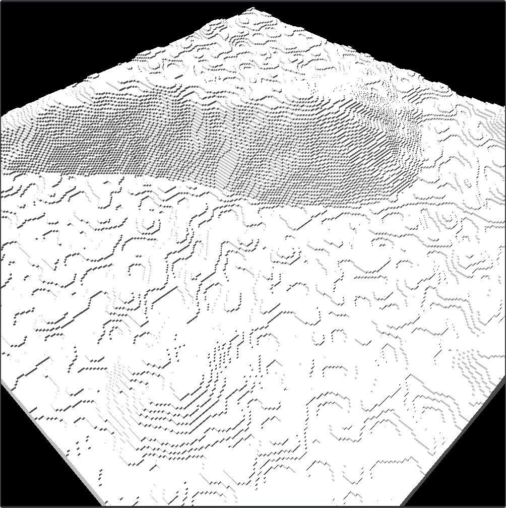
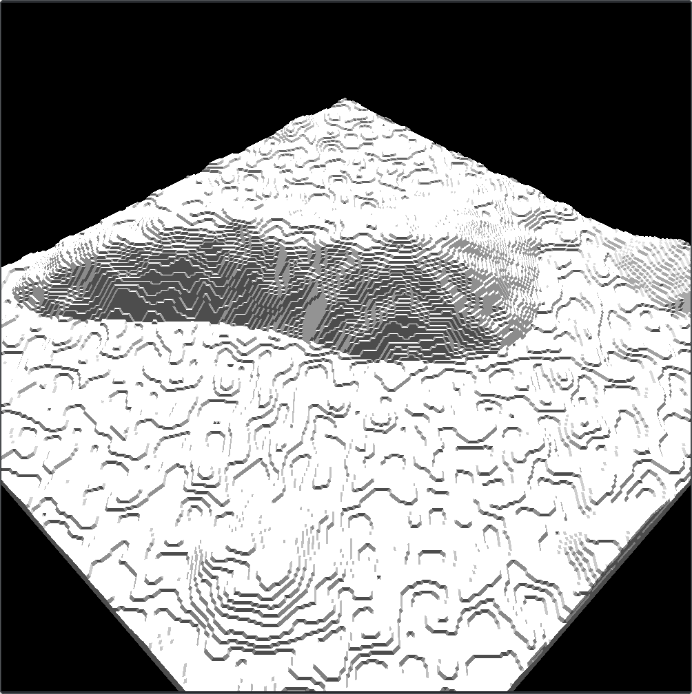
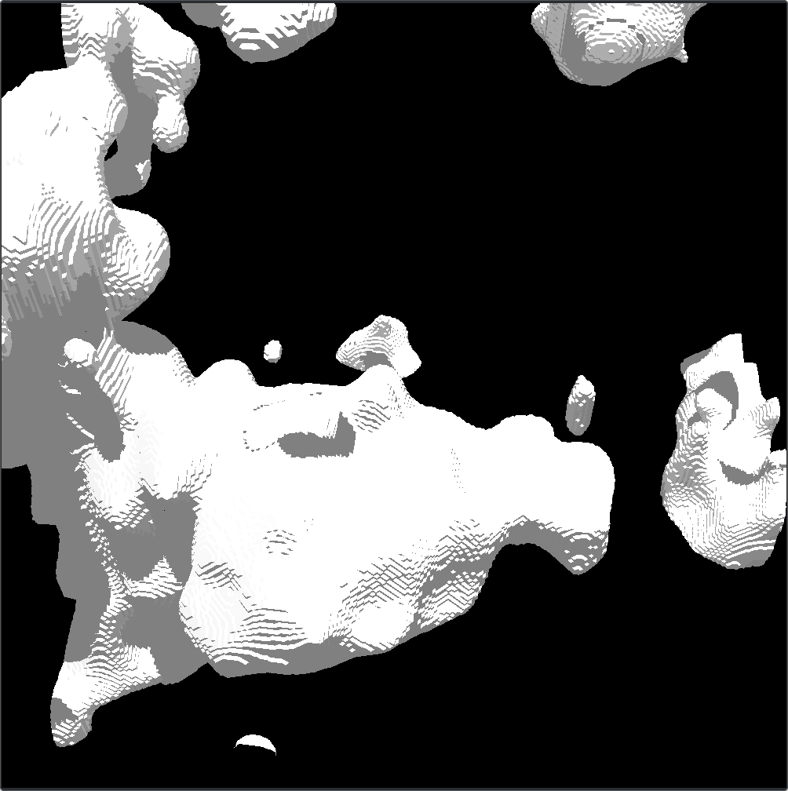

# Voxel Terrain
Exploration of terrain generation techniques based on voxels.

## Build
Run `make` on root to build.
```
> make
```
The folder `bin` holds all executables.

## Run
To run a basic voxel terrain defined by Perlin noise use:
```
> ./bin/voxels
```
To run the same terrain but with a smoother surface using marching cubes:
```
> ./bin/marching
```
To generate a terrain defined by a 3D Perlin noise, also smoothed by marching cubes:
```
> ./bin/marching3d
```
To run a terrain generation optimized by chunks:
```
> ./bin/perlin-chunks
```

## Screeshots

|   | 
|:---:|:---:|
| Basic voxel based terrain with Perlin Noise  | Terrain smoothed by marching cubes


|   |
|:---:|
| Terrain generated from a 3D Perlin Noise  | 
